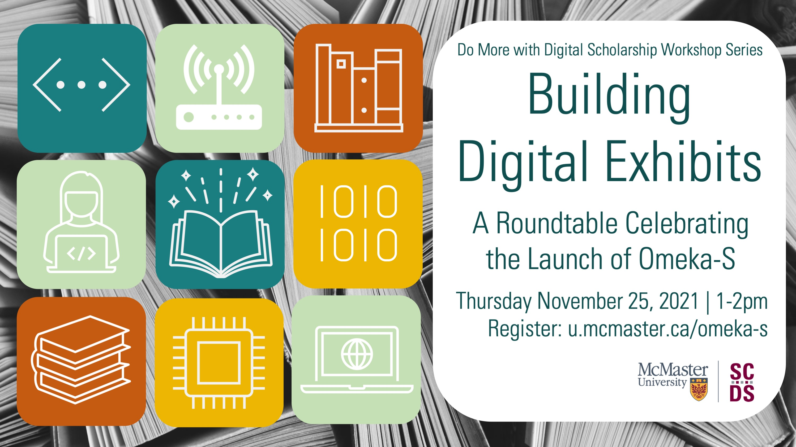

# Welcome to Building Digital Exhibits: 
# A Roundtable Celebrating the Launch of Omeka S at McMaster. 

Learn about the variety of uses and possibilities for digital scholarly exhibits with the digital exhibit platform Omeka S. In this roundtable. members of the McMaster communty will share some of their experences working with Omeka in classroom projects, research dissemination, organizing digital collections, and more.

Proceed to the [Preparation](preparation) page to find out if Omeka is the right tool for your next classroom or research project! 

